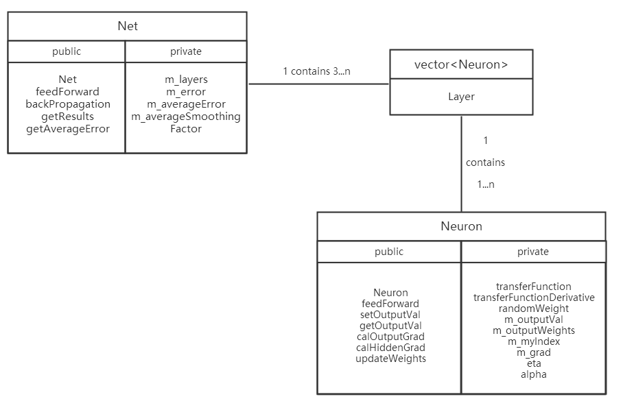

<!-- documentation for course: C++ programming -->
# C++ programming 课程大作业文档
---
<!-- TOC -->

- [C++ programming 课程大作业文档](#c-programming-课程大作业文档)
- [1. 整体概述](#1-整体概述)
    - [1.1 编程环境](#11-编程环境)
    - [1.2 功能介绍](#12-功能介绍)
    - [1.3 辅助功能](#13-辅助功能)
- [2. 类说明](#2-类说明)
    - [2.1 类设计习惯](#21-类设计习惯)
    - [2.2 类间关系](#22-类间关系)
    - [2.3 具体实现](#23-具体实现)
        - [2.3.1 class Neuron](#231-class-neuron)
            - [接口](#接口)
        - [2.3.2 class Net](#232-class-net)
            - [接口](#接口-1)
        - [2.3.3 class TrainData](#233-class-traindata)
            - [接口](#接口-2)
        - [2.3.4 class Print](#234-class-print)
            - [接口](#接口-3)
        - [2.3.5 其他类型](#235-其他类型)
- [3. 工程结构](#3-工程结构)
    - [3.1 代码编写习惯](#31-代码编写习惯)
    - [3.2 文件夹结构](#32-文件夹结构)
    - [3.3 create*.cpp](#33-createcpp)
    - [3.4 test*.cpp](#34-testcpp)

<!-- /TOC -->

# 1. 整体概述

## 1.1 编程环境
- 系统环境：Windows 10
- 开发环境：vscode + minGW + GDB
## 1.2 功能介绍
- 命令行输入网络拓扑结构，生成相应multi-layer perceptron
- 自动添加bias node并将其输出设置为定值1.0
- 随机生成网络初始权重
- 根据输入及权重前向传播，计算网络输出
- 从文件中读取训练输入数据和目标输出
- 反向传播计算误差并更新权重（训练网络)
- 若输入/输出数据格式/大小与网络结构不符，输出错误信息
## 1.3 辅助功能
- 按照要求生成规定格式的训练数据
- 测试程序，对网络进行训练并观察训练效果
- 训练过程中输出每步输入输出及总网络误差
# 2. 类说明
## 2.1 类设计习惯
- 所有类以首字母大写表示，如：Neuron, Net
- 类内成员函数按如下规则表示：feedForward, transferFunctionDerivative
- 类私有成员数据前加m_标识：m_error, m_myIndex
- static 成员不用m_标识
- 访问函数用get/set标识：getOutputVal
- 尽量多用const限制函数参数或成员函数
- 尽量多用unsigned代替int，防止数据范围溢出
- 尽量多用引用代替指针
- 较大数据类型的参数，如:struct/vector/class，用传引用代替传值

## 2.2 类间关系

## 2.3 具体实现
### 2.3.1 class Neuron
作为“神经元”的类，是网络中最基本的单元结构。

```c++
class Neuron
{
  public:
    Neuron(unsigned numOutputs, unsigned myIndex);
    void feedForward(const Layer &preLayer);
    void setOutputVal(double val);
    double getOutputVal() const;
    void calOutputGrad(double tragetVal);
    void calHiddenGrad(const Layer &nextLayer);
    void updateWeights(Layer &preLayer);

  private:
    static double transferFunction(double sum); 
    static double transferFunctionDerivative(double x);
    static double randomWeight();
    double m_outputVal;
    vector<Connection> m_outputWeights;
    unsigned m_myIndex;
    double m_grad;
    static double eta;   // overall net learning rate
    static double alpha; // momentum
};
```
#### 接口
|接口       |参数       |返回值     |注释       |
|-|:-:|:-:|:-:|
|Neuron     |unsigned<br>unsigned|--|constructor|
|feedForward|const Layer &|void|根据前一层神经元输出及权重前向传播|
|setOutputVal|double|void|修改m_outputVal|
|getOutputVal|void|double|const成员函数，访问m_outputVal|
|calOutputGrad|double|void|计算输出层的m_grad|
|calHiddenGrad|const Layer &|void|计算隐藏层的m_grad|
|updateWeight|Layer &|void|更新前一层神经元的权重|

### 2.3.2 class Net
作为“网络”的类，内有至少三层Layer，每个Layer都是Neuron的容器。

```c++
class Net
{
  public:
    Net(const vector<unsigned> &topology);
    void feedForward(const vector<double> &inputVals);
    void backPropagation(const vector<double> &targetVals);
    void getResults(vector<double> &resultVals);
    double getAverageError() const;

  private:
    vector<Layer> m_layers; // m_layers[layerNum][neuronNum]
    double m_error;
    double m_averageError;
    static double m_averageSmoothingFactor;
};
```
#### 接口
|接口       |参数       |返回值     |注释       |
|-|:-:|:-:|:-:|
|Net|const vector unsigned &|--|constructor|
|feedForward|const vector double &|void|整个网络对输入值进行前向传播|
|backPropagation|const vector double &|void|整个网络对目标值进行反向传播|
|getResults|vector double &|void|访问网络输出层的输出值|
|getAverageError|void|double|const成员函数，访问m_averageError|

### 2.3.3 class TrainData
用于获取网络初始化参数（拓扑结构）及相关训练/测试数据的类。

```c++
class TrainData
{
  public:
    TrainData(const string filename);
    void getTopology(vector<unsigned> &topology);
    bool ifEof();
    unsigned getInputVals(vector<double> &inputVals);
    unsigned getTargetVals(vector<double> &targetVals);

  private:
    ifstream m_dataFile;
};
```
#### 接口
|接口       |参数       |返回值     |注释       |
|-|:-:|:-:|:-:|
|TrainData|const string|--|constructor|
|getTopology|vector unsigned &|void|从命令行读取网络拓扑结构|
|ifEof|void|bool|判断文件是否读到结尾|
|getInputVals|vector double &|unsigned|从文件中读输入数据，返回输入数据矩阵大小，用于异常检测|
|getTargetVals|vector double &|unsigned|从文件中读目标输出，返回目标输出矩阵大小，用于异常检测|

### 2.3.4 class Print
主要为测试程序服务，用来打印过程中的一些重要参数。
```c++
class Print
{
  public:
    void printDoubleVectorVals(string label, vector<double> &v);
    Print();

  private:
};
```
#### 接口
|接口       |参数       |返回值     |注释       |
|-|:-:|:-:|:-:|
|Print|void|--|constructor|
|printDoubleVectorVals|string<br>vector double &|void|输出double容器中数据|

### 2.3.5 其他类型
- struct Connection

```c++
struct Connection
{
    double weight;
    double deltaWeight;
};
```
- Layer

```c++
typedef vector<Neuron> Layer;
```
# 3. 工程结构
## 3.1 代码编写习惯
- 一个头文件一般只放一个类
- 同名的cpp文件存放相应类的具体实现
- 类外内联函数/全局变量等，统一放到一个头文件中
- 创建训练数据的文件以create标识
- 测试文件以test标识
- trainingSet中存放生成的训练数据集

## 3.2 文件夹结构
```
D:.
│  .gitignore
│  documentation.md
│  README.md
│
├─.vscode
│      c_cpp_properties.json
│      launch.json
│      settings.json
│      tasks.json
│
├─img
│      1.png
│
├─src
│      createFuncData.cpp
│      createXorData.cpp
│      mlp.cpp
│      mlp.h
│      mlp.o
│      net.cpp
│      neuron.cpp
│      neuron.h
│      neuron.o
│      print.cpp
│      print.h
│      print.o
│      testFunc.cpp
│      testFunc.o
│      testXor.cpp
│      testXor.o
│      trainData.cpp
│      trainData.h
│      trainData.o
│
└─trainingSet
        funcData.txt
        xorData.txt
```
## 3.3 mlp相关文件
- mlp.h/.cpp 存放class Net的声明及实现
- neuron.h/.cpp 存放class Nueron/struct Connection/Layer的声明及实现
- trainData.h/.cpp 存放class TrainData的声明及实现
- print.h/.cpp 存放class Print的声明及实现

## 3.4 create*.cpp
用来生成数据，其中createXorData.cpp用来生成“异或逻辑”的训练数据，createFuncData.cpp用来生成“函数拟合”的训练数据。

需要特别注意，因为cpp中没有文件读写操作，故数据是直接输出到终端，需要使用输出重定向将cpp输出重定向到文件中，做法如下:

`g++ createXorData.cpp -o data.exe`

`./data.exe > ../trainingSet/xorData.txt`

以上的相对路径请自行修改。

此外，在训练时发现了一个隐蔽的问题，window 10默认的txt编码方式好像是UTF-16 LE，而TrainData读取的数据默认是UTF-8格式，在转码时会产生错误。解决办法时在生成数据之后，用UTF-8格式重新保存txt文档即可。

## 3.5 test*.cpp
用来测试网络的学习效果。本次主要从两个方面对multi-layer perceptron进行测试，分别是：XOR分类问题，以及sin函数拟合问题。
- testXor.cpp 测试XOR分类问题
- testFunc.cpp 测试sin函数拟合问题

因为本次没有使用IDE作编译环境，故直接在终端进行编译和链接，操作如下：

`g++ -c trainData.cpp print.cpp neuron.cpp mlp.cpp testXor.cpp`

`g++ trainData.o print.o neuron.o mlp.o testXor.o -o a.exe`

`./a.exe`

即可观察测试效果。

注意，训练数据和目标输出是直接从文件读取的，但是网络初始化阶段，拓扑结构需要用户在终端输入，从左到右分别是输入层-隐藏层1-隐藏层-...-输出层，每层数字代表神经元个数，不包括bias神经元，输入形式如下：

`2 4 1`

意味着有3层结构，输入层2个神经元，隐藏层4个神经元，输出层1个神经元，是解决XOR分类问题的常用网络结构。

